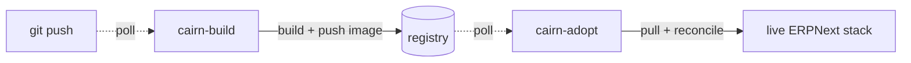

# cairn

Frappe + ERPNext + your custom apps, on a single VPS, running the current commit — automatically.

cairn owns its Docker build recipe and compose configuration outright
(bootstrapped from [`frappe/frappe_docker`](https://github.com/frappe/frappe_docker)) and pairs it with a CI/CD lifecycle you won't find anywhere
else for a Frappe stack:

**build**, **register**, and **converge a live deployment**
* no GitHub Actions
* no webhooks
* no infrastructure to run.

> _Cairn: a trail marker of stacked stones. Each deploy drops a durable marker
> (ref → resolved commits → image tag → digest) you can navigate back to._

## The magic

Push to a tracked branch. That's the whole workflow:

Two lightweight systemd timers do the polling — one on the builder, one on the target. Both
reach *outward*; neither GitHub nor anything else ever reaches *in*. No GitHub Actions
runner, no webhook receiver, and no SSH key handed to GitHub for access to your VPS — the
box never opens a port for this. A merged commit becomes a rebuilt image, pushed and tagged,
and a running stack that pulls it, migrates, and restarts — all within minutes, with zero CI
infrastructure to stand up or pay for.

## Three roles, one install

| | **Builder** — `cairn-build` | **Registry** — `cairn-registry` | **Target** — `cairn-adopt` |
| --- | --- | --- | --- |
| Does | Builds the image, pushes it, moves the environment pointer | Hosts images, if you self-host — optional, bring your own registry instead | Polls for the pointer, pulls, and converges the running stack |

One `pip install datahenge-cairn` installs all three.

📖 **Read the docs: [datahenge.github.io/cairn](https://datahenge.github.io/cairn/)**

Start with [Get Started](https://datahenge.github.io/cairn/get-started/) for installation,
or jump straight to the [Builder](https://datahenge.github.io/cairn/builder/),
[Target](https://datahenge.github.io/cairn/target/), and
[Registry](https://datahenge.github.io/cairn/registry/) walkthroughs.
